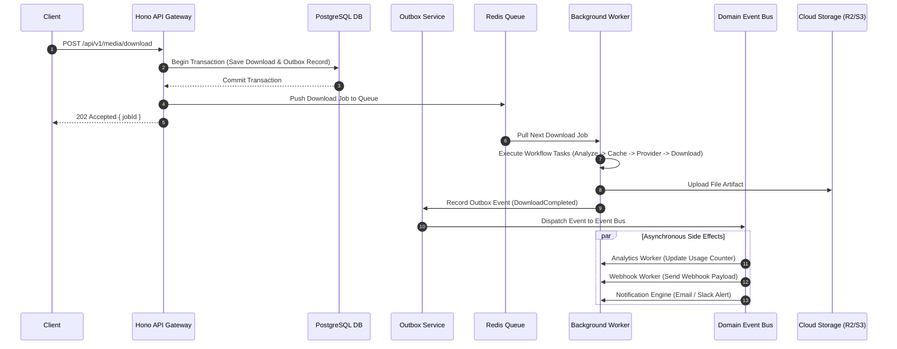
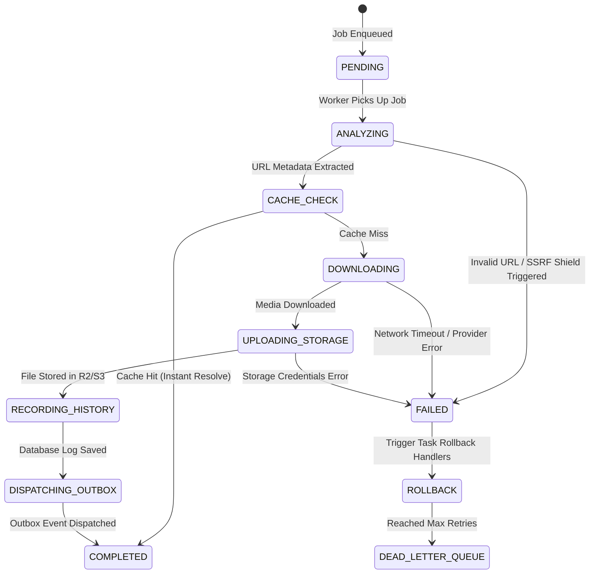

# MediaHub System Architecture Overview

This document provides a high-level overview of the **MediaHub Distributed Platform Architecture**.

---

## 🔀 Workflow Task Sequence Diagram

The download pipeline is orchestrated using `packages/workflows` as a sequence of discrete, retryable `WorkflowTask` instances.

---

## 🔄 Workflow Task State Machine Diagram

