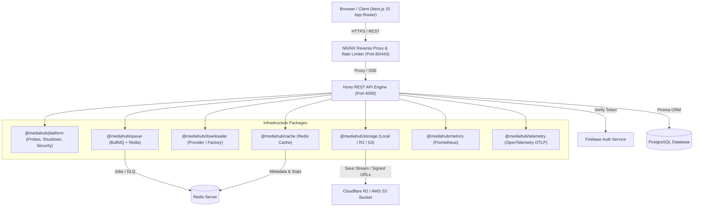
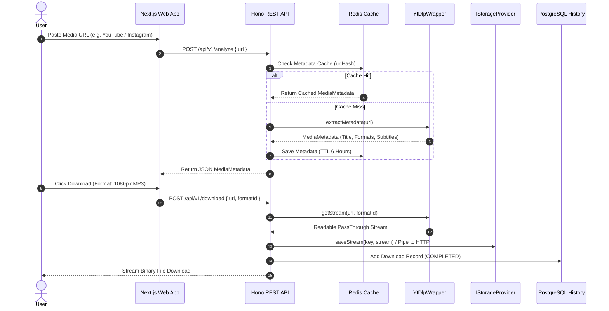
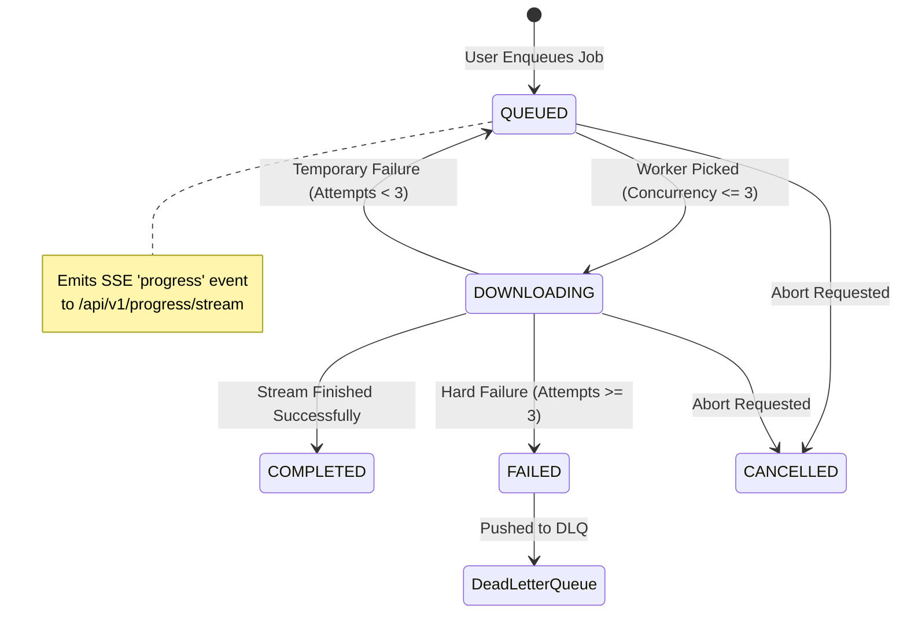
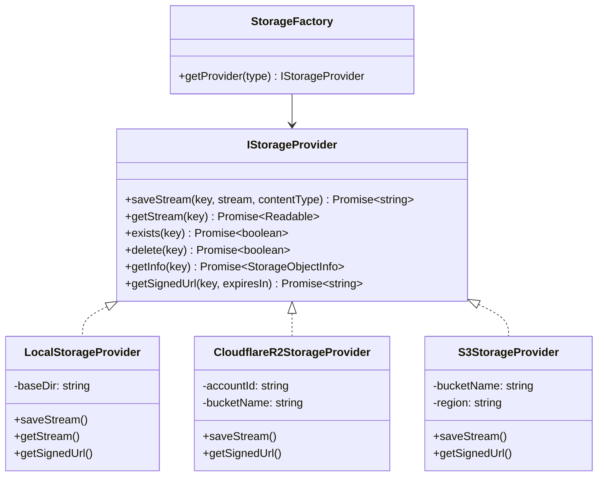
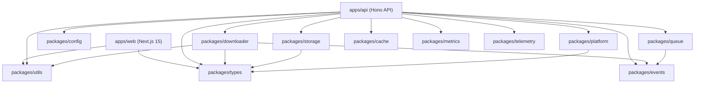

# MediaHub System Architecture Diagrams

This document outlines the high-level architecture, request flows, queue lifecycle, storage abstraction, deployment topology, and monorepo package dependency graph of **MediaHub**.

---

## 1. High-Level System Architecture

---

## 2. Media Download Pipeline

---

## 3. Queue Lifecycle & Multi-Job SSE Stream

---

## 4. Storage Provider Abstraction (`IStorageProvider`)

---

## 5. Monorepo Package Dependency Graph

